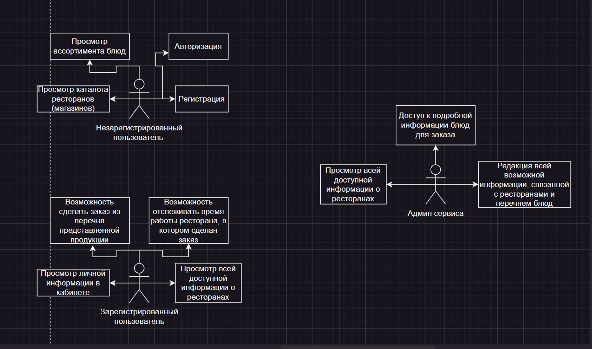
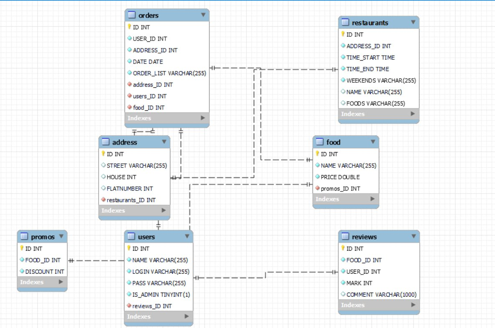
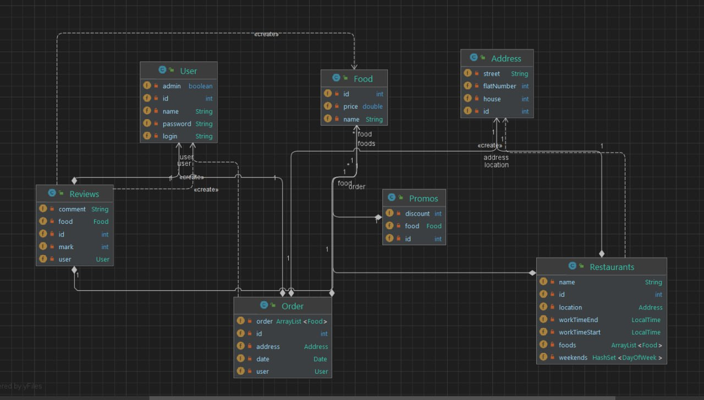
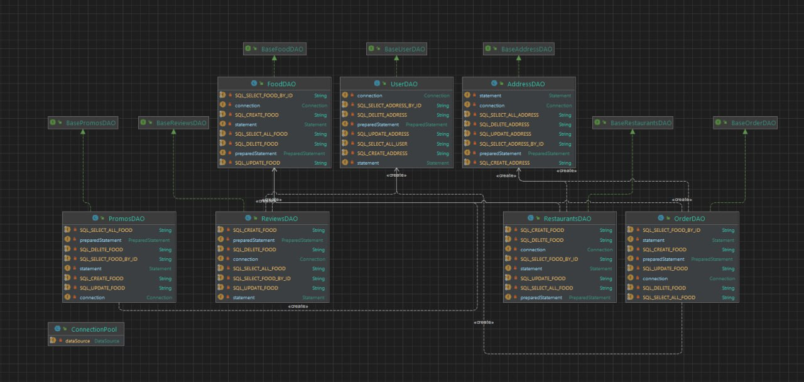
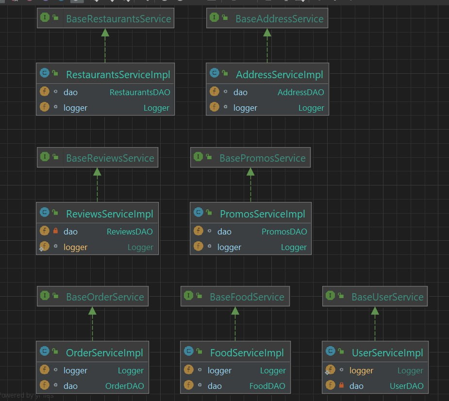
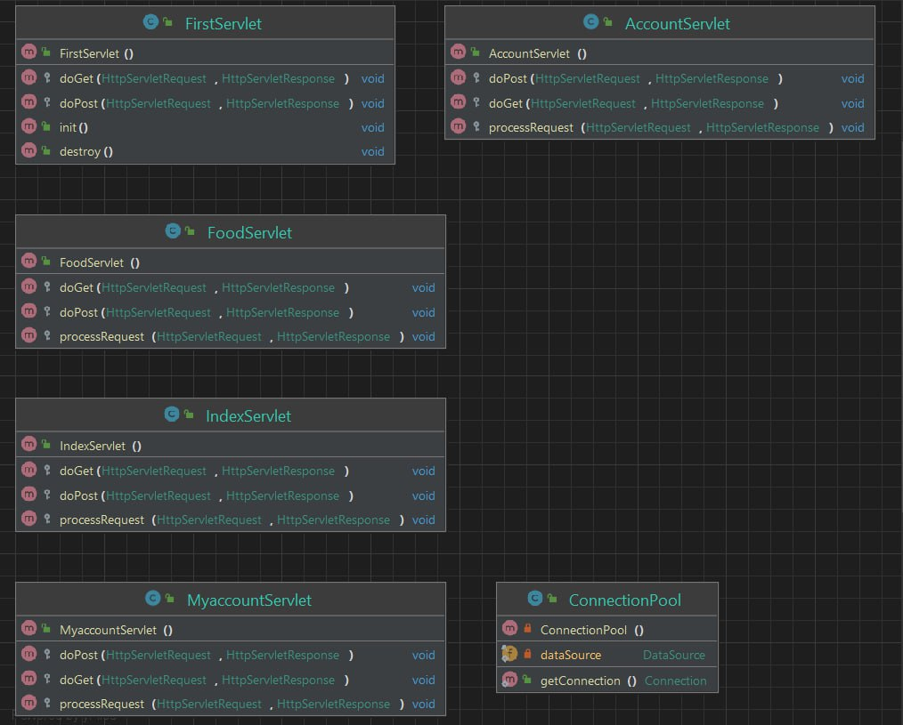
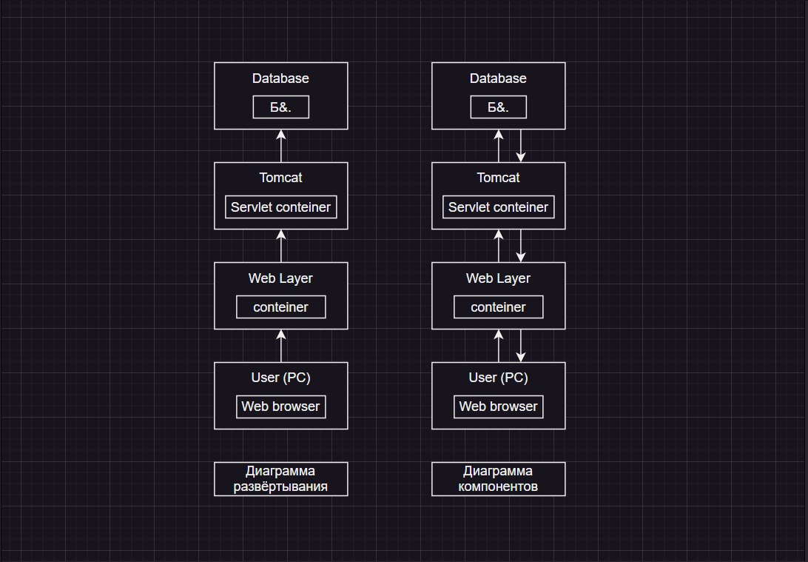

# Быстро и точка
## Описание
Сайт доставки еды. С несколькими типами еды, корзиной, возможностью выкладывания объявлений с помощью сайта, возможностью заказа доставки, учетные записи клиента, доставщика, продавца еды, админ-редактор. Пользователи могут рассматривать объявления о продаже еды, заказывать блюдо на конкретный адрес, регистрироваться, оставлять отзывы о еде и продавце. Клиент заказывает еду, оставляет отзывы. Доставщик может брать заказ, просматривать информацию о заказе. Продавец еды может размещать заказы. Администратор-редактор может банить пользователей, продавцов, заказчиков, удалять\размещать объявления, комментарии.
Цели проекта:  
Наш проект не преследует какие-либо бизнес-цели, его разработка целенаправлена на получение опыта в разработке аналогичных проектов.

## Используемые технологии
Для разработки данного проекта мы использовали технологии, указанные в следующем списке:
-  Java 19
-  Apache Tomcat - контейнер сервлетов Java для развертывания веб-приложений
-  Maven - инструмент для управления зависимостями, сборки проекта и управления жизненным циклом проекта
-  MySQL - СУБД проекта
-  Apache Logging Log4j2 - библиотека для логирования
-  JSTL - библиотека тегов для разработки веб-приложений с использованием технологии JSP
-  io.swagger - набор инструментов и библиотек, предназначенных для работы со Swagger
-  Connection Pool для управления подключениями к базе данных.
-  JUnit - фреймворк для модульного тестирования
-  Bootstrap v5.0.0
-  HTML
-  CSS
-  JavaScript

## Use case diagram

## ER-модель базы данных

## Диаграммы классов

## Диаграмма компонентов и диаграмма развертывания

